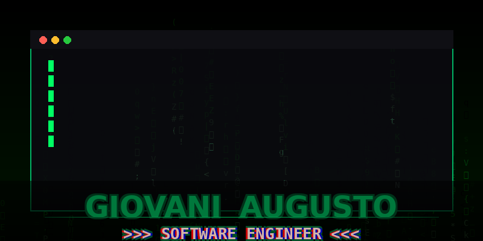

    

<h1></h1>
I am a software engineering student with an interest in backend development and areas related to Artificial Intelligence. My goal is to specialize in Machine Learning, Deep Learning, and Artificial Neural Networks, building a solid foundation in both theory and practice.Currently, my professional focus is on working as a backend developer, deepening my knowledge primarily in Python, as well as in Java.

### Languages and Tools:

  <a href="https://www.w3schools.com/python/default.asp" target="blank">
  <a href="https://www.w3schools.com/java/default.asp" target="blank">
  <a href="https://www.w3schools.com/mysql/default.asp" target="blank">
  <a href="https://www.w3schools.com/git/default.asp" target="blank">
  <a href="https://github.com/" target="blank">
  <a href="https://code.visualstudio.com/" target="blank">
  <a href="https://www.w3schools.com/js/default.asp" target="blank">
  <a href="https://www.w3schools.com/html/default.asp" target="blank">
  <a href="https://www.w3schools.com/css/default.asp" target="blank">
</h1>
