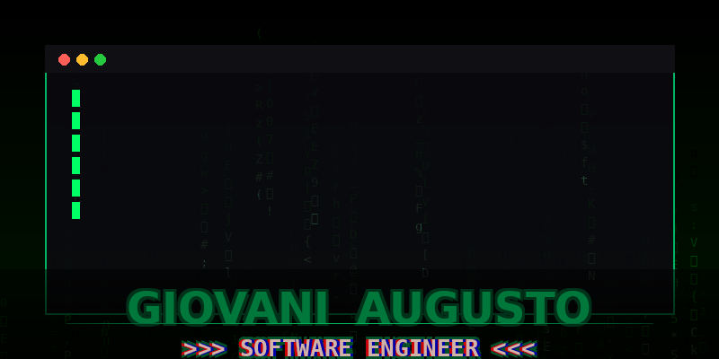

    

<h4>I am a Software Engineering student focusing on backend and Artificial Intelligence. My long-term goal is to specialize in Machine Learning, Deep Learning, and Artificial Neural Networks, developing a strong foundation in both theoretical concepts and practical implementation.</h4>

### Languages and Tools:

